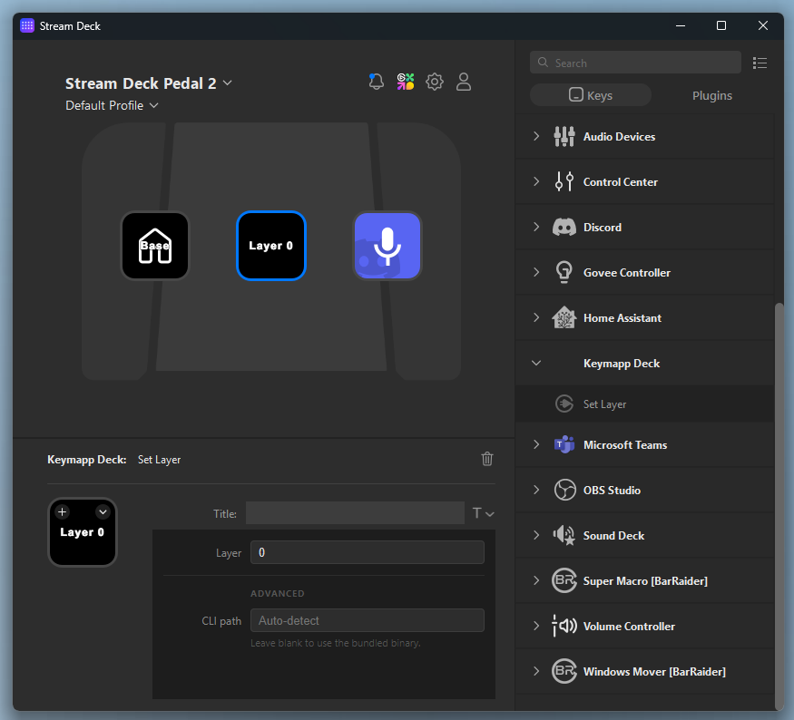

# Keymapp Deck

A Stream Deck plugin for controlling your ZSA keyboard — switch layers, adjust backlight brightness, and set RGB colors, all with a single button press.

## What it does

Each Stream Deck key can be configured to control your ZSA keyboard (Moonlander, Voyager, ErgoDox EZ, etc.). Press a key and the action happens instantly.



### Available actions

| Action | Description |
|---|---|
| **Set Layer** | Switch your keyboard to a specific layer (0-indexed). The key label updates to show the assigned layer. |
| **Increase Brightness** | Step up the keyboard backlight brightness. |
| **Decrease Brightness** | Step down the keyboard backlight brightness. |
| **Set RGB (All Keys)** | Set every key on the keyboard to a chosen color. Pick from a color swatch or enter a hex value. |

## Requirements

- A ZSA keyboard (Moonlander, Voyager, ErgoDox EZ)
- [Keymapp](https://www.zsa.io/keymapp) installed and running
- Keymapp API enabled: **Keymapp → Settings → Enable API**
- Stream Deck hardware + software (version 6.7 or later)

## Installation

### macOS / Windows installer (recommended)

1. Download the latest `.dmg` (macOS) or `.exe` (Windows) from the [Releases](../../releases) page.
2. **macOS:** Open the DMG, drag **Keymapp Deck** to Applications. On first launch, right-click the app and choose **Open**, then click **Open** in the dialog — macOS blocks unsigned apps by default, this bypasses it once.
3. **Windows:** Run the installer.
4. The installer checks your Keymapp connection, copies the plugin to Stream Deck's plugin folder, and restarts Stream Deck automatically.

### Stream Deck plugin only

Download the `.streamDeckPlugin` file from [Releases](../../releases) and double-click it. Stream Deck will install it directly. You'll need to make sure the `kontroll` binary inside the plugin has execute permission on macOS (the installer handles this automatically).

## How to use

1. Open Stream Deck.
2. Find **Keymapp Deck** in the action list on the right.
3. Drag any action onto a key.
4. Configure it in the settings panel:
   - **Set Layer** — enter the layer number (0-indexed, matching your Keymapp layout).
   - **Set RGB (All Keys)** — pick a color from the swatch or type a hex value.
   - **Increase / Decrease Brightness** — no configuration needed, just press.
5. Press the key — the action fires instantly.

You can mix and match actions across as many keys as you like.

## How it works

The plugin communicates with Keymapp through its local gRPC API using the bundled [`kontroll`](https://github.com/zsa/kontroll) CLI binary. No separate installation of `kontroll` is needed — it's included in the plugin bundle. When you press a Stream Deck key, the plugin runs the appropriate `kontroll` command in the background:

- `kontroll set-layer --index N`
- `kontroll increase-brightness`
- `kontroll decrease-brightness`
- `kontroll set-rgb-all --color RRGGBB`

The Keymapp API must be running for any action to work. If Keymapp is closed or the API is disabled, the Stream Deck key will flash an alert instead.

## Gotchas

- **Keymapp must be open** whenever you want to use the plugin. Keys will show an alert (⚠) if Keymapp isn't reachable.
- **Enable the API in Keymapp** before use: Keymapp → Settings → Enable API. This is a one-time setup.
- **Layer numbers are 0-indexed.** Layer 1 in Keymapp's UI is layer `0` here, layer 2 is `1`, and so on.
- **macOS first-launch warning** — see Installation above.
- The bundled `kontroll` binary targets macOS (universal) and Windows x64. If you need a different architecture, set a custom CLI path in the action's advanced settings.

## Advanced

Each action's settings panel has an **Advanced** section with a **CLI path** field. Leave it blank to use the bundled binary. Set it to a custom path if you want to use a specific version of `kontroll` you've installed yourself.

## Building from source

```sh
npm install
node scripts/download-kontroll.mjs   # downloads kontroll binaries into the plugin
npm run build                         # compiles TypeScript → plugin.js
npm run installer:dev                 # runs the Electron installer locally
```

To build distributable installers:

```sh
npm run dist:mac   # macOS DMG
npm run dist:win   # Windows EXE
```
